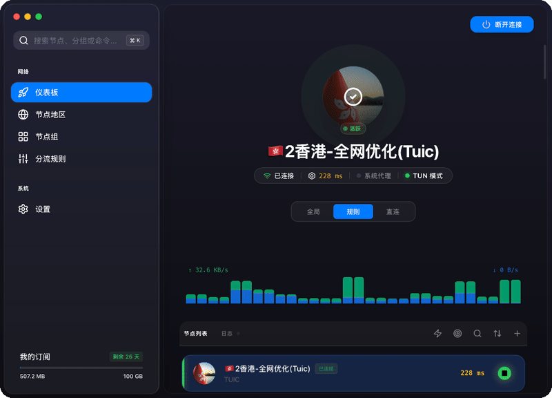

# Tunnet

<p align="center">
  
</p>

<p align="center">
  <strong>基于 Tauri 和 sing-box 的现代跨平台代理客户端。</strong>
</p>

<p align="center">
  <a href="README.md">English</a>
</p>

<p align="center">
  
</p>


---

Tunnet 是一款为现代互联网设计的强大且幽雅的代理客户端。基于 Rust (Tauri) 的高性能与 sing-box 的多功能性，它为 macOS、Windows 和 Linux 用户提供了卓越的网络流量管理体验。

### ✨ 核心特性

- 🎨 **极致视觉体验**: 采用现代设计语言，拥有精致的仪表盘、地图可视化、流畅的动画特效以及深度适配的深/浅色模式。
- 🚀 **强悍核心驱动**: 基于业界领先的 sing-box 核心，确保高性能网络转发与极低延迟。
- 🛡️ **TUN 模式与系统代理**: 支持全系统级代理和虚拟网卡模式，一键开启，无感加速。
- 🌍 **全球地图可视化**: 在交互式地图上实时展示节点分布与流量动态。
- 🛠️ **预设智能分流方案**:
  - **智能连接 (Smart Connect)**: 自动分流中国大陆流量并默认拦截广告。
  - **全局代理/直连**: 快速切换不同的全局工作模式。
  - **绕过局域网与大陆**: 专为低延迟访问优化。
- ⚡ **实时延迟检测**: 精准的 HTTP/TCP 延迟测试，助你快速筛选最佳节点。
- 🔗 **深度链接支持**: 支持通过 `tunnet://` 或 `sing-box://` 协议快速导入订阅。
- 💻 **全平台覆盖**: 在 macOS、Windows 和 Linux（包含 GNOME 桌面环境原生支持）上均提供一致的使用体验。
- 🌐 **多语言支持**: 完整支持中英文切换。

### 🛠️ 技术栈

- **前端**: Next.js, TypeScript, Tailwind CSS (v4), shadcn/ui.
- **后端**: Rust (Tauri), Go (通过 FFI 集成 sing-box 核心)。
- **通信**: Tauri IPC 与 Deep Links 深度链接。

### 🚀 快速上手

#### 前置要求
- Node.js (v20 或更高版本)
- Rust (最新稳定版)
- Go (用于核心库编译)

#### 开发模式
```bash
# 安装依赖
npm install

# 启动开发环境
npm run tauri dev
```

#### 构建发行版
```bash
# 构建生产版本
npm run build
npm run tauri build
```

---

<p align="center">
  Made with ❤️ by the Tunnet Team
</p>
